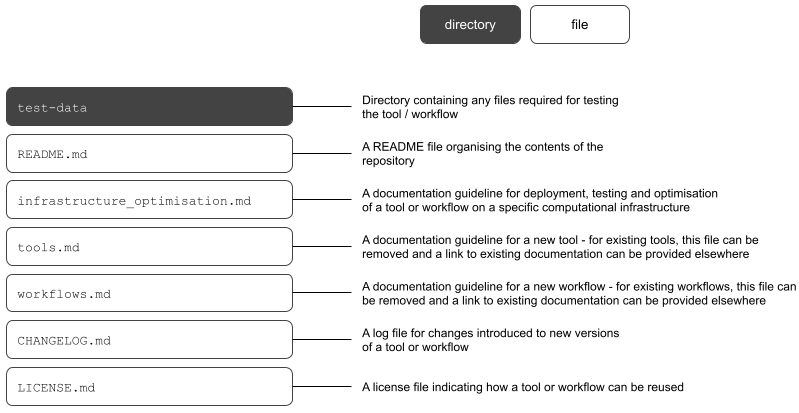

# Documentation Guidelines for tools and workflows

**Do you want your tools and workflows to be documented in a standard way?**

**If the answer is yes, then read on!**

---

## Why do the [documentation guidelines](https://github.com/AustralianBioCommons/doc_guidelines) exist?

The Australian BioCommons has been working with community bioinformaticians and our infrastructure partners to establish a guidelines repository that can act as a template for documentation of tools and workflows.

The repository aims to provide guidance and a minimal starting template for:

- Documenting a new [tool](https://github.com/AustralianBioCommons/doc_guidelines/blob/master/tools.md) or [workflow](https://github.com/AustralianBioCommons/doc_guidelines/blob/master/workflows.md)
- Documenting tool or workflow access, use and [optimisation on infrastructures](https://github.com/AustralianBioCommons/doc_guidelines/blob/master/infrastructure_optimisation.md)
- Recommending additional repository contents that make your work more [FAIR](https://www.go-fair.org/fair-principles/)

>The Australian BioCommons guidelines are based on learnings from existing efforts, including our own projects, but also the Galaxy, NextFlow and Snakemake communities.

---

## Should I contribute to an existing community workflow effort instead?

The [BioCommons guideline](https://github.com/AustralianBioCommons/doc_guidelines) is based on learnings from multiple community efforts including the Galaxy [Intergalactic Workflow Commission (IWC)](https://github.com/galaxyproject/iwc), [nf-core](https://nf-co.re/) and [Snakemake](https://github.com/snakemake-workflows).

If you are using Galaxy, Nextflow or Snakemake workflow languages and would like to contribute to their community workflow efforts, **you could be using their specific guidelines**, which are linked to below.

| Community effort | Workflow language documentation | Workflow guideline information | How to create / contribute new workflows |
|:----:|:----:|:----:|:----:|
|IWC | Galaxy |[IWC GitHub](https://github.com/galaxyproject/iwc/blob/main/workflows/README.md#workflows)|[IWC adding workflows](https://github.com/galaxyproject/iwc/blob/main/workflows/README.md#adding-workflows)|
|nf-core | Nextflow |[nf-core developer guidelines](https://nf-co.re/developers/guidelines)|[nf-core adding_pipelines](https://nf-co.re/developers/adding_pipelines)|
|Snakemake | Snakemake |[Snakemake-workflows guidelines](https://github.com/snakemake-workflows/docs#guidelines)|[Snakemake-workflows contribute](https://github.com/snakemake-workflows/docs#contribute)|

## What does the BioCommons template repository look like?

---

## How might I use the BioCommons guidelines?

---
