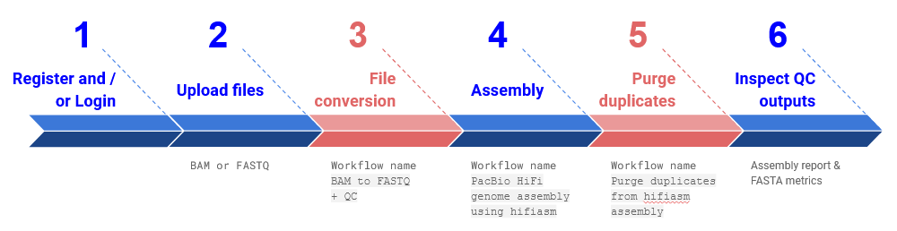

# *De novo* genome assembly with hifiasm on [Galaxy Australia](https://usegalaxy.org.au/)

[Galaxy Australia](https://usegalaxy.org.au/) is capable of *de novo* assembling genomes based on PacBio high fidelity reads built from circular consensus sequence HiFi reads.

This How-to-Guide will describe the steps required to assemble your genome on the Galaxy Australia platform, using multiple workflows (see **Fig 1**) developed in consultations between the Bioplatforms Australia [Threatened Species Initiative](https://threatenedspeciesinitiative.com/), [Galaxy Australia](https://usegalaxy.org.au/), and the [Australian BioCommons](https://www.biocommons.org.au/).

<details open markdown="block">
  <summary>
    Table of contents
  </summary>
  {: .text-delta }
1. TOC
{:toc}
</details>

---

> **If you need help, the Galaxy community is both approachable and helpful.**
[**Ask them questions!**](https://help.galaxyproject.org/)

---

# The overall workflow


*Fig 1. The approach described in this How-to-Guide, including Quick Start guide steps 1) registration, 2) upload of input BAM file, 3) BAM to FASTQ conversion workflow, 4) assembly workflow, 5) purge duplicates workflow and 6) reviewing the assembly report and FASTA metrics. Required workflow steps are blue, and optional steps are red.*

Further to this, a summary of the different elements of this assembly approach are detailed below:

| Process name     | Workflow name                             | Description                                                                          | Inputs                                                              | Outputs                                                                                                     |
| ---------------- | ----------------------------------------- | ------------------------------------------------------------------------------------ | ------------------------------------------------------------------- | ----------------------------------------------------------------------------------------------------------- |
| UPLOAD FILES     | Not applicable                            | See the different upload options in section 5.2.                                     | BAM (start at step 3 in Fig 1), or FASTQ (start at step 4 in Fig 1) | Not applicable                                                                                              |
| FILE CONVERSION  | BAM to FASTQ + QC                         | Conversion of files from BAM to FASTQ, including a FASTQC quality control (QC) step. |                                                                     | FASTQ file, FASTQC report HTML file                                                                         |
| ASSEMBLY         | PacBio HiFi genome assembly using hifiasm | Assembly using the hifiasm tool, including Bandage visualisation and QC.             |                                                                     | Assembly file in FASTA format, FASTA metrics, Assembly report file                                          |
| PURGE DUPLICATES | Purge duplicates from hifiasm assembly    | Optional workflow to purge duplicates from the contig assembly.                      |                                                                     | Purged primary sequences from draft assembly (FASTA), Purged haplotig sequences from draft assembly (FASTA) |

- The WorkflowHub entries
     - File conversion: [BAM to FASTQ + QC](https://workflowhub.eu/workflows/220)
     - Assembly: [PacBio HiFi genome assembly using hifiasm](https://workflowhub.eu/workflows/221)
     - Purge duplicates: [Purge duplicates from hifiasm assembly](https://workflowhub.eu/workflows/237)

---

# Quick start guide

1. Login to Galaxy Australia
2. Create a new history
3. Upload your HiFi ```ccs.bam``` data files to your Galaxy history
4. Load and execute workflows, using required options
     - FILE CONVERSION workflow: ```BAM to FASTQ + QC``` **optional**
     - ASSEMBLY workflow: ```PacBio HiFi genome assembly workflow```
     - PURGE DUPLICATES workflow: ```Purge duplicates from hifiasm assembly``` **optional**
5. Review workflow report and perform additional QC as needed
6. Re-run workflows, or individual tools, as needed

---

# In-depth guide

## Register and login

1. To register for Galaxy Australia, visit the [login page](https://usegalaxy.org.au/login).
2. Click the ```Register here``` link, as shown in **Fig 2**.
3. Complete the registration wizard and click ```Create```.
4. Login to your account!

---

## Upload data file(s)

> **FAQ: can data be seamlessly transferred from 
the Data Portal to Galaxy Australia?**
The Australian BioCommons is working with the 
Bioplatforms Australia data portal team to develop 
a direct transfer mechanism from the portal to 
Galaxy Australia histories. This solution will be made 
available as soon as possible.

5. Select your data using the Bioplatforms Data Portal

     - The files you need for the assembly are ```.css.bam``` format
     - **Fig 3** shows a HiFi data set selected in the data portal browser interface.

6. Click ```Access``` and select ```Copy Download URL``` in the drop down menu (see **Fig. 3**)

> **Note:** This will copy a download URL to your clipboard. 
**The URL is time sensitive and will expire after 10 minutes.** 
Please note you only need to instigate the 
download within this 10 minute window. The import itself can take 
longer than 10 minutes.

7. In Galaxy Australia, perform the steps outlined in **Fig. 4**

     - Step 1: Click on ```Upload Data``` 
     - Step 2: Select ```Paste/Fetch data```
     - Step 3: Paste the URL you obtained from the data portal into the content box.
     - Step 4: Select ```Start```

> **Note:** you can paste multiple URLs in this box. If you have more than 1 SMRT cell of data, you will need to copy the URLs for each of the ccs.bam files and paste them in here.

---

## Other data transfer options are also available

### Self-managed (download & upload)

- [Download](https://usersupport.bioplatforms.com/programmatic_access.html) required HiFi data to your personal computer, then
- Upload / transfer to Galaxy Australia (see **Fig 5**)
     - Note: the following Galaxy Training Network tutorial provides guidance on [how to upload files via URL](https://training.galaxyproject.org/training-material/topics/introduction/tutorials/galaxy-intro-short/tutorial.html#upload-a-file). The same mechanism can be used to upload local files, by selecting ```Choose local files``` (see **Fig 5**).

### Self-managed (Cloudstor mediated)

- Upload / transfer data to Cloudstor (see [Getting Started Guide](https://support.aarnet.edu.au/hc/en-us/articles/227469547-CloudStor-Getting-Started-Guide)), then
- Upload / transfer to Galaxy Australia (see ```Import from CloudStor``` tool in Galaxy Australia)

### Supported

- Contact the [Galaxy Australia Support team](mailto:help@genome.edu.au) for data chaperoning.

---

## OPTIONAL STEP: convert BAM files to FASTQ 

> **READ ME**

>*You must do this step if your files are in ```ccs.bam``` format*

>*This step is not needed if files are already in FASTQ format*

>*You will need to complete this workflow for each BAM file*


1. Make sure you are logged into Galaxy Australia

2. [Visit this link]() and retrieve the workflow for file conversion by clicking the import workflow button at the top right

3. Navigate to your list of workflows by clicking on the ```Workflow``` tab (highlighted by a red box in **Fig 6**) in the Galaxy interface.

4. Once you have reached the workflow screen, select the ```play``` button (highlighted by a red box in **Fig 7**) for the ```BAM to FASTQ + QC``` workflow.

> **Did you know?**
You can view the workflow diagram by clicking on the 
workflow name in the list and selecting ```Edit```.

5. The workflow invocation window will open. Select the BAM file that you previously loaded into your Galaxy history using the drop-down menu (step 1 in **Fig 8**).

> **WARNING:** depending on the contents of your BAM file, the parameters (options) chosen will impact the file produced.

6. Click ```Run workflow``` (step 2 in **Fig 8**).

7. The workflow will produce

     - A ```FASTQ file``` that will be the input for the assembly workflow covered in the next section (**Fig 9a**), and
     - A ```FastQC report``` which you can view in the Galaxy user interface (**Fig 9b**).
	 
> **Did you know?**
You don’t need to re-run entire workflows!
You can re-run individual tools in Galaxy Australia by selecting the previous tool run in your history and pushing the button indicated below.

8. If you only have a single BAM file, stop here! If you have multiple BAM files, repeat this entire section of the tutorial for each BAM file:

>**Don’t forget:** you will then need to [join the multiple FASTQ files together](#joinfiles).
Another tool called ```Concatenate datasets tail-to-head``` (Galaxy Version 0.1.1) can be used for this purpose.

---

## Assembly workflow

1. Make sure you are logged into Galaxy Australia

2. [Visit this link]() and retrieve the assembly workflow by clicking the import workflow button at the top right

3. Navigate back to your list of workflows by clicking on the ```Workflow``` tab in the Galaxy interface (highlighted by a red box in **Fig 6**) 

4. Once you have reached the workflow screen, select the play button (highlighted by a red box in **Fig 7**) for the ```PacBio HiFi genome assembly using hifiasm``` workflow (the workflow is shown in **Fig 10**).

5. The workflow invocation window will open. 

6. Select the FASTQ file that was produced by the ```BAM to FASTQ + QC``` workflow using the drop-down menu.

7. Select correct workflow input parameters

8. Click the ```Run workflow``` button (as in step 2 of **Fig 8**).

9. The ```PacBio HiFi genome assembly using hifiasm``` workflow produces the following outputs:

     - Bandage info and images for:
          - Primary assembly contig graph
          - Alternate assembly contig graph
          - Processed unitig graph
          - Haplotype resolved raw unitig graph
     - FASTA file for the primary assembly contig GFA file
     - Fasta statistics for primary assembly contig FASTA file
	 
> **Did you know?**
You can access the other assembly output types for hifiasm (haplotype resolved, unitig graph and alternate assembly).
They are just hidden so that the workflow highlights the provision of the primary assembly contig graph.
For instructions on how to reveal hidden files, see [this link](#hiddenfiles).

---