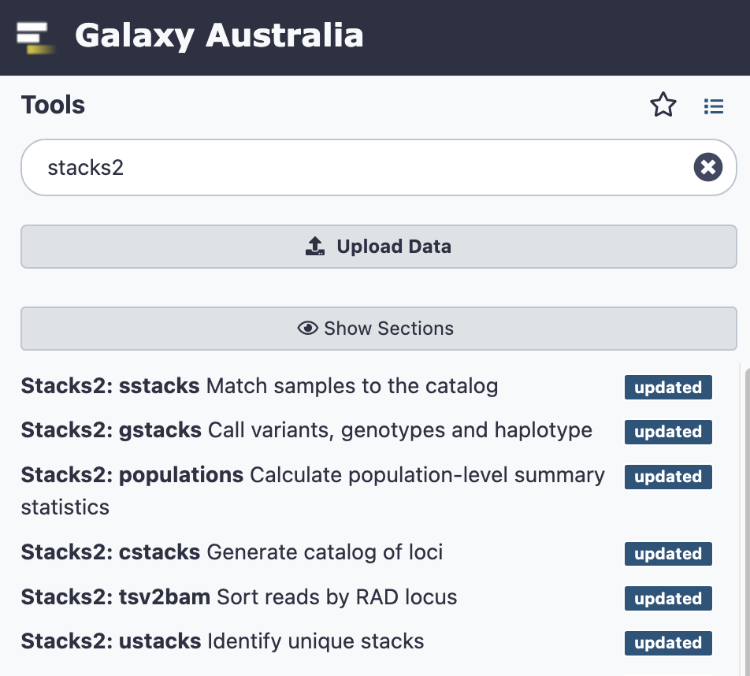
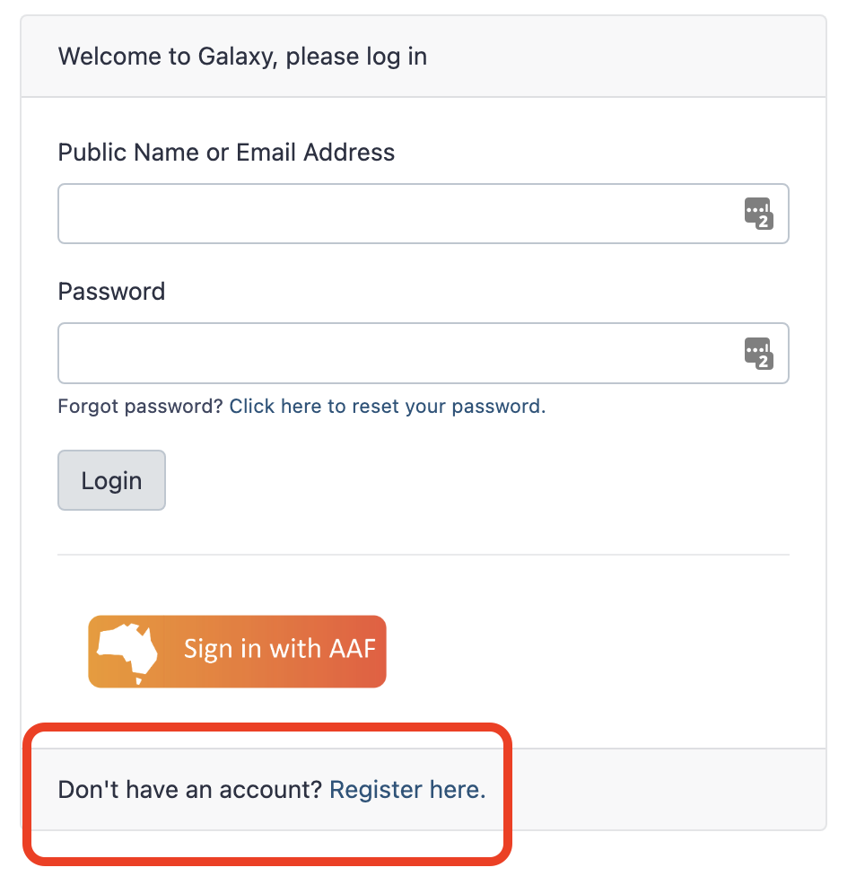
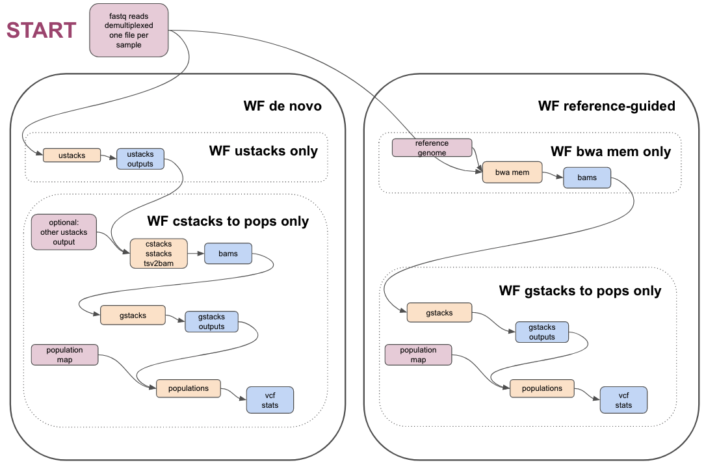

## Introduction & context

This How-to-Guide will describe the steps required to run the Stacks workflows on [Galaxy Australia](https://usegalaxy.org.au/) to analyse RADseq data, using workflows developed in consultations between the Bioplatforms Australia Threatened Species Initiative, Galaxy Australia, and the Australian BioCommons.

### What is Galaxy?

* A web-based place to analyse your data. 
* For more information see [Galaxy Australia — Australian BioCommons](https://www.biocommons.org.au/galaxy-australia)
* For introductory tutorials see [Introduction to Galaxy Analyses](https://training.galaxyproject.org/training-material/topics/introduction/)
* For help see [Galaxy Community Help](https://help.galaxyproject.org/) or email help@genome.edu.au

### What is RAD-seq?

For an introduction see these Galaxy tutorials for [RAD-Seq Reference-based data analysis](https://training.galaxyproject.org/training-material/topics/ecology/tutorials/ref-based-rad-seq/tutorial.html) & [RAD-Seq de-novo data analysis](https://training.galaxyproject.org/training-material/topics/ecology/tutorials/de-novo-rad-seq/tutorial.html)

### What is Stacks?

Stacks is used to analyse RADseq data. 

* For detail, see the [Stacks manual](http://catchenlab.life.illinois.edu/stacks/manual/#files)
* In Galaxy, the available Stacks modules are installed separately (e.g. `ustacks`, `gstacks`)
* There are also two modules ([ref_map](https://usegalaxy.org.au/root?tool_id=toolshed.g2.bx.psu.edu/repos/iuc/stacks2_refmap/stacks2_refmap/) & [denovo_map](https://usegalaxy.org.au/root?tool_id=toolshed.g2.bx.psu.edu/repos/iuc/stacks2_denovomap/stacks2_denovomap/)) that run certain sets of other modules; these are described more in the Stacks manual. 

Please note that:

* Older module versions are named in the format `Stacks:module_name`
* Newer module versions are named in the format <code>Stacks<strong>2</strong>:module_name</code>
* To see all modules in Stacks2, for example, type <strong>Stacks2</strong> in the tool panel.

    

### Recommended prerequisites and suggestions

* Before running large analyses with Stacks in Galaxy, we recommend becoming familiar with the Galaxy interface, particularly via the introductory tutorials in the link above. 
* We also highly recommend reading the manual for the Stacks tools, and trying the Galaxy RAD-seq tutorials (links above). 
* Real data sets often require troubleshooting at various places during analysis. This may be due to sample quality and associated sequencing quality, or other unpredictable features of real data sets. Some suggestions are listed in this how-to guide in anticipation of where troubleshooting may be required.
* If you are encountering issues with your sequencing reads, it may be useful to contact the sequencing provider to obtain further information about whether any samples were problematic during sequencing. 
* If you are unsure about outputs from Stacks a useful place for questions is [https://groups.google.com/g/stacks-users](https://groups.google.com/g/stacks-users)
* For tool issues in Galaxy, please email [help@genome.edu.au](mailto:help@genome.edu.au)

## Galaxy setup

### Log in to Galaxy

* To register for Galaxy Australia, visit the [login page](https://usegalaxy.org.au/login).
* Click the `Register here` link
* Complete the registration wizard and click `Create`.
* Login to your account.

    

### Get data: Import sequence reads in fastq format. 

1. To import BPA data, see [https://australianbiocommons.github.io/how-to-guides/galaxy_australia/upload_data](https://australianbiocommons.github.io/how-to-guides/galaxy_australia/upload_data)
2. The files you need are ddRAD fastq.gz
3. To import test data, see the information in the tutorial [RAD-Seq Reference-based data analysis](https://training.galaxyproject.org/training-material/topics/ecology/tutorials/ref-based-rad-seq/tutorial.html)

### Demultiplex the reads if needed

1. If the reads need demultiplexing, run the `process_radtags` tool: search in the tool panel for 'stacks2 process radtags'
2. Each read will have the format: 4bp barcode + ~4bp enzyme cut site + rest of the read
3. You will need to know the enzymes used, and a barcodes file in text format. This has a single barcode on each line, e.g. AACC. 

### Group the reads into a single collection

1. In your Galaxy history, find the small tick icon at the top right. Click on this. 
2. Then select all of the fastq read files
3. Click "For all selected ...." and choose "Build Dataset List". This list can now be used as input into the Galaxy workflows described later in this guide.

### Reads QC, optional




A workflow with some potentially relevant QC steps is listed and described below. 

### Import a reference genome if using the reference-guided workflow

* If you are using the reference-guided workflow you will need to import a reference genome. This can be from the same species as your samples, or possibly a closely-related species. 
* This should be in fasta format. 
* One way to do this is to find a relevant genome on NCBI, download to your computer, unzip, and find the file in fasta format (may be listed as .fna) before uploading to Galaxy. 
* (The tool in Galaxy to directly download a particular accession is failing and is under investigation.)
* If there are multiple files (e.g. one fasta file per chromosome), it would be best to concatenate these into a single fasta file. This can be done in Galaxy; search for the tool "Concatenate datasets tail-to-head (cat)".

### Create or amend a population map

For more information about the population map format, see the Stacks manual. 

To create a population map in Galaxy:

1. Go to Upload Data
2. Click "Paste/Fetch" data
3. Paste in the population map
4. For File Type select tabular
5. In the cog wheel under Settings, tick "convert spaces to tabs" 
6. Click Start, then close
    
To change a population map in Galaxy:

1. Click on the eye icon to view an existing population map
2. Copy the text
3. Paste it in to create a new file, as described above. 
4. Modify it as required, before saving. 

**You can upload a population map directly into Galaxy. **



For more troubleshooting, you can check if a pop map is formatted correctly (if comfortable with the commandline):
as explained more here: ​​[https://groups.google.com/g/stacks-users/c/6-F5mETPv-A?pli=1](https://groups.google.com/g/stacks-users/c/6-F5mETPv-A?pli=1)

1. Download popmap to desktop
2. in terminal type `head [popmap filename] | od -c`
3. check if any odd characters e.g. extra invisible chars or newlines at start
4. to edit: `nano [popmap filename]`; edit, save, reupload to Galaxy 
    
To delete a line in a population map, for example to exclude a particular sample for the analysis, 

1. Search for "replace" in the tool panel
2. Select the tool called "Replace text in an entire line"
3. The input file is the current population map
4. For "Find pattern", enter in the sample name that you want to delete, followed by a dot and an asterisk, e.g. SampleXYZ.*
5. For "Replace with" leave blank

## The Galaxy workflows!

### What is a Galaxy workflow

A Galaxy workflow is a set of tools and settings, that can take in certain inputs and produce certain outputs. For more about this, see [Creating, Editing and Importing Galaxy Workflows](https://training.galaxyproject.org/training-material/topics/galaxy-interface/tutorials/workflow-editor/tutorial.html)

**Image showing an overview of the Stacks workflows:**

    

### Links to workflows

<table>
  <tr>
   <td><strong>Workflow name</strong>
   </td>
   <td><strong>Link to workflow</strong>

<strong>in Galaxy Australia</strong>
   </td>
   <td><strong>Link to workflow</strong>

<strong>in workflow hub</strong>
   </td>
  </tr>
  <tr>
   <td>QC of reads, if required
   </td>
   <td><a href="https://usegalaxy.org.au/u/anna/w/qc-of-radseq-reads">https://usegalaxy.org.au/u/anna/w/qc-of-radseq-reads</a>
   </td>
   <td><a href="https://workflowhub.eu/workflows/346">https://workflowhub.eu/workflows/346</a>
   </td>
  </tr>
  <tr>
   <td><strong>Reference-guided Stacks workflow</strong>
   </td>
   <td><a href="https://usegalaxy.org.au/u/anna/w/stacks-ref-guided-workflow">https://usegalaxy.org.au/u/anna/w/stacks-ref-guided-workflow</a>
   </td>
   <td><a href="https://workflowhub.eu/workflows/347">https://workflowhub.eu/workflows/347</a>
   </td>
  </tr>
  <tr>
   <td>
    Partial ref-guided workflow: BWA MEM only
   </td>
   <td><a href="https://usegalaxy.org.au/u/anna/w/ref-guided-wf-bwa-mem">https://usegalaxy.org.au/u/anna/w/ref-guided-wf-bwa-mem</a>
   </td>
   <td><a href="https://workflowhub.eu/workflows/351">https://workflowhub.eu/workflows/351</a>
   </td>
  </tr>
  <tr>
   <td>
    Partial ref-guided workflow: gstacks and pops only 
   </td>
   <td><a href="https://usegalaxy.org.au/u/anna/w/ref-guided-wf-gstacks-pops">https://usegalaxy.org.au/u/anna/w/ref-guided-wf-gstacks-pops</a>
   </td>
   <td><a href="https://workflowhub.eu/workflows/352">https://workflowhub.eu/workflows/352</a>
   </td>
  </tr>
  <tr>
   <td><strong>De novo Stacks workflow</strong>
   </td>
   <td><a href="https://usegalaxy.org.au/u/anna/w/stacks-denovo-wf">https://usegalaxy.org.au/u/anna/w/stacks-denovo-wf</a>
   </td>
   <td><a href="https://workflowhub.eu/workflows/348">https://workflowhub.eu/workflows/348</a>
   </td>
  </tr>
  <tr>
   <td>
    Partial de-novo workflow: ustacks only
   </td>
   <td><a href="https://usegalaxy.org.au/u/anna/w/de-novo-wf-ustacks-only">https://usegalaxy.org.au/u/anna/w/de-novo-wf-ustacks-only</a>
   </td>
   <td><a href="https://workflowhub.eu/workflows/349">https://workflowhub.eu/workflows/349</a>
   </td>
  </tr>
  <tr>
   <td>
    Partial de-novo workflow: cstacks, sstacks, gstacks, populations only
   </td>
   <td><a href="https://usegalaxy.org.au/u/anna/w/denovo-c-s-g-pops">https://usegalaxy.org.au/u/anna/w/denovo-c-s-g-pops</a>
   </td>
   <td><a href="https://workflowhub.eu/workflows/350">https://workflowhub.eu/workflows/350</a>
   </td>
  </tr>
</table>





### To import a workflow

1. Click on the link to the workflow, and then the "import workflow" button at the top right
2. Or, in the top Galaxy tab, go to "Shared Data", Click on "Workflows"
3. Find the workflow, click on the drop down arrow, and Import

### How to see the workflow layout and default settings

1. After importing the workflow, go to the top Galaxy tab "Workflows".
2. This brings up a list of your workflows. 
3. Click on the drop-down arrow next to a workflow. 
4. Click "edit" to see the workflow layout. 
5. You can see how the inputs and tools are connected. 
6. Click each tool box, and the right hand panel will show the default settings.
7. You can drag the inputs and tools around to see things better.  

### To run a workflow

1. Create a new Galaxy history with the files needed.
2. Go to the top Galaxy tab "Workflows".
3. Find the workflow you need. 
4. At the right hand side, click on the triangle play button to run the workflow. 
5. Select the correct inputs. (Galaxy may have automatically selected some files but they may not be correct). 
6. Change any options required. 
7. At the top right, click "Run workflow"
8. The output files will now begin to populate into your current history. 

### How to copy and change a workflow

1. After importing the workflow, go to the top Galaxy tab "Workflows". This brings up a list of your workflows. 
2. Click on the drop-down arrow next to a workflow. 
3. Click "copy" 
4. Rename the copy. 
5. Open to edit, make changes, and save. 

## QC workflow

### Inputs

* demultiplexed reads in fastq format, in a collection
* two adapter sequences in fasta format, for input into cutadapt

**Image of the workflow:**

### Steps and outputs



The workflow steps are:

1. Run `FastQC` to get statistics on the raw reads, send to `MultiQC` to create a nice output. This is tagged as "Report 1" in the Galaxy history. 
2. Run `Cutadapt` on the reads to cut adapters - enter two files with adapter sequence at the workflow option for "Choose file containing 3' adapters". The default settings are on except that the "Maximum error rate" for the adapters is set to 0.2 instead of 0.1. Send output statistics to `MultiQC`, this is "Report 2" in the Galaxy history. 



{:start="3"}

3. Send these reads to fastp for additional filtering or trimming. Default settings are on but can be modified as needed. Send output statistics to `MultiQC`, this is "Report 3" in the Galaxy history. 
4. The filtered and trimmed reads are then ready for the stacks workflows. 

## Reference-guided workflow

### Inputs

* demultiplexed reads in fastq format, may be output from the QC workflow. Files are in a collection. 
* population map in text format
* reference genome in fasta format

**Image of the workflow:**

### Steps and outputs

#### BWA MEM 2

* The reads are mapped to the reference genome; output in BAM format
* The collection of bam files is named something like `Map with BWA-MEM on collection 5 (mapped reads in BAM format)`
* Each of the bam files in the collection is named something like` sample_CAAC`

#### Samtools stats before filtering

* These bam files are sent to `Samtools stats` to get statistics; these are then sent to `MultiQC` to provide a nice output. This is tagged as "bam stats before filtering" in the Galaxy history. 
* The "General Statistics" show how many reads were mapped - if there is a low mapping rate, it may be worth re-checking or repeating QC on the raw reads, or considering a different reference genome, or using a de novo approach.
* To see if many reads have been soft-clipped by Bwa mem (which may affect how well gstacks can work), look at the "Alignment Metrics" section, and the row with "Mapped bases (Cigar)". Hover over the dots to see sample names especially towards the left of the row - these have the least mapped reads.

#### Samtools view

* This step filters out certain reads from the bam files. The default settings are to exclude reads if they are unmapped, if the alignment is not primary or is supplementary, if the read fails platform/vendor quality checks, and if the read is a PCR or optical duplicate. 
* The output bams are tagged with "filtered bams" in the Galaxy history.

#### Samtools stats after filtering

* Filtered bams are sent again to `Samtools stats`, and statistics to `MultiQC`, with the report tagged as "bam stats after filtering" in the Galaxy history. 

#### gstacks

* Filtered bams and a population map are sent to gstacks. The outputs are:
* Catalog of loci in fasta format
* Variant calls in VCF format
* For more detail see the "gstacks output" section 
* Note: some bam files cause errors here with gstacks. For example, the log file may say "Error, all records discarded with file SampleXYZ.FASTQ.bam, Aborted".
* If this occurs, check the bam stats (as described above). Some of the options are to re-do QC on the raw reads, change settings for mapping reads in BWA MEM, and/or delete this sample/s from the population map and proceed to gstacks. 
* The sample can still remain in the list of bam files but gstacks will only consider what is listed in the pop map. 
* To amend the population map see the section "Create or amend a population map"

#### populations

* gstacks outputs and a population map are sent to the "populations" module. The outputs are:
* Locus consensus sequences in fasta format
* Snp calls, in VCF format
* Haplotypes, in VCF format
* Summary statistics
* For more detail see the "populations outputs" section 

### Option: Run only bwa mem

* This workflow takes in  demultiplexed reads in fastq format (in a collection) and a reference genome in fasta format. 
* The outputs are a set of filtered bam files, ready for the next part of the stacks workflow (e.g. gstacks), and statistics on the bam files. 

### Option: Run only gstacks + populations

This workflow takes in bam files and a population map and produces output from gstacks and populations, as described above. 

## De novo workflow

 

### Inputs:

* demultiplexed reads in fastq format, may be output from the QC workflow. Files are in a collection. 
* population map in text format

**Image of the workflow:**

### Steps and outputs

#### ustacks

* input reads go to `ustacks`. 
* `ustacks` assembles the reads into matching stacks (hypothetical alleles). 
* The outputs are in a collection called something like: `Stacks2: ustacks  on data 21, data 20, and others Loci and polymorphism`. Click on this to see the files:
* for each sample, assembled loci (tsv format), named e.g. `sample_CAAC.tags`
* for each sample, model calls from each locus (tsv format), named e.g. `sample_CAAC.snps`
* for each sample, haplotypes/alleles recorded from each locus (tsv format), named e.g. `sample_CAAC.alleles`
* Please see **sections 6.1 to 6.4** in [https://catchenlab.life.illinois.edu/stacks/manual/#ufiles](https://catchenlab.life.illinois.edu/stacks/manual/#ufiles) for a full description. 

#### cstacks

* cstacks will merge stacks into a catalog of consensus loci. 
* The outputs are in a collection called something like `Stacks2: cstacks  on data 3, data 71, and others Catalog of loci`. Click on this to see the three files, each in tsv format:
* `catalog.tags`
* `catalog.snps`
* `catalog.alleles`

#### sstacks

* sstacks will compare each sample to the loci in the catalog. 
* The outputs are in a collection called something like `Stacks2: sstacks  on data 3, data 76, and others Matches to the catalog.`Click on this to see the files:
* There is one file for each sample, named e.g. `sample_CAAC.matches`, in tsv format. 

#### tsv2bam

* Conversion to BAM format
* Reads from each sample are now aligned to each locus, and the tsv2bam tool will convert this into a bam file for each sample. 
* The outputs are in a collection called something like `Stacks2: tsv2bam  on data 3, data 94, and others Matches to the catalog.`Click on this to see the files:
* There is one file for each sample, named e.g `sample_CAAC.matches`, in BAM format. 

#### gstacks

* Catalog of loci in fasta format
* Variant calls in VCF format
* For more detail see the "gstacks output" section

#### populations

* Locus consensus sequences in fasta format
* Snp calls, in VCF format
* Haplotypes, in VCF format
* Summary statistics
* For more detail see the "populations output" section

### Option: run only ustacks

You may want to run ustacks with different batches of samples. To be able to combine these later, there are some necessary steps - we need to keep track of how many samples have already run in ustacks, so that new samples can be labelled with different identifying numbers.  

1. In ustacks, under "Processing options" there is an option called "Start identifier at". 
2. The default for this is 1, which can be used for the first batch of samples. These will then be labelled as sample 1, sample 2 and so on. 
3. For any new batches of samples to process in ustacks, we will want to start numbering these at the next available number. e.g. if there were 10 samples in batch 1, this should then be set to start at 11. 

To combine multiple outputs from ustacks, providing these have been given appropriate starting identifiers:

1. Find the ustacks output in the Galaxy history. This will be a list of samples. 
2. Click on the cross button next to the filename to delete, but select "Collection only". This releases the items from the list, but they will now be hidden in the Galaxy history.
3.  In the history panel, click on "hidden" to reveal any hidden files. Unhide the samples. 
4. Do this for all the batches of ustacks outputs that are needed. 
5. Click on the tick button, tick all the samples needed, then "For all selected" choose "Build dataset list"
6. This is now a combined set of samples for input into cstacks. 

### Option: run only cstacks onwards

This workflow takes in ustacks output, and runs cstacks, sstacks, gstacks, and populations. 

## Overall output: SNPs and statistics

### Gstacks output

After getting BAM files, gstacks runs to create two files in collection called something like `Stacks2: gstacks  on data 3, data 39, and others Assembled contigs and variant sites`. Click on this to see the files:

* Consensus sequences of each loci, formed by assembling all the reads from each locus. `catalog.fa.gz`
* Variant calls for each locus. `catalog.calls.vcf` Reads from each sample have been aligned back to the consensu loci sequences. Each line in this VCF file is a single position, with or without a snp. Scroll to the right to see which samples contain reads that support this information. 
* Please see **sections 6.5 gstacks** [https://catchenlab.life.illinois.edu/stacks/manual/#gfiles](https://catchenlab.life.illinois.edu/stacks/manual/#gfiles) for a full description. 

### Populations output

#### consensus sequences of each locus

* Please see **section 6.6.7 RAD loci FASTA output** in [https://catchenlab.life.illinois.edu/stacks/manual/#pop_fasta](https://catchenlab.life.illinois.edu/stacks/manual/#pop_fasta) for a full description. 
* e.g. Per-locus consensus sequence: `Stacks2: populations on data 3, data 43, and data 42 per-locus consensus sequences`

#### variant calls for each locus 

* Please see **section 7.2.1 populations.snps.vcf** in [https://catchenlab.life.illinois.edu/stacks/manual/#coords](https://catchenlab.life.illinois.edu/stacks/manual/#coords) for a full description. 
*  Each row is a snp call. The information per sample is over to the right. 
* e.g. `Stacks2: populations on data 3, data 43, and data 42 SNPs in VCF format`

#### haplotypes in VCF format

* Please see **section 7.3 RAD haplotypes** in [https://catchenlab.life.illinois.edu/stacks/manual/#coords](https://catchenlab.life.illinois.edu/stacks/manual/#coords) for a full description. 

* These are the haplotypes per locus, phased into groups of snps. 
* e.g.` Stacks2: populations on data 3, data 43, and data 42 Haplotypes in VCF format`

#### summary statistics for the populations

* Many summary statistics are produced, and the outputs files are named clearly. 
* Please see **section 6.6 populations** and **section 7.1.1 populations.sumstats.tsv** in [https://catchenlab.life.illinois.edu/stacks/manual/#pfiles](https://catchenlab.life.illinois.edu/stacks/manual/#pfiles) for a full description. 
* e.g. the file with a summary of summary statistics for each population is called something like `Stacks2: populations  on data 3, data 43, and data 42 Summary of Population-level summary statistics`

### Troubleshooting and converting outputs

* Columns in output files may not correspond exactly to those described in the Stacks manual [http://catchenlab.life.illinois.edu/stacks/manual/#files](http://catchenlab.life.illinois.edu/stacks/manual/#files). There is some description in the tool interface (see below the tool parameters) for what the output format is, particularly for the populations module. Please contact the Galaxy team if something is unclear. 
* In older versions of Stacks, a summary.html is available but may not display. Download and open to view. 

#### Convert to Migrate format

* This is not available as an option in the current version of Stacks in Galaxy, but there is a script to convert if needed:  (not tested) [https://github.com/paulmaier/fasta2genotype](https://github.com/paulmaier/fasta2genotype), discussed here [https://groups.google.com/g/migrate-support/c/zWonJshYM_4?pli=1](https://groups.google.com/g/migrate-support/c/zWonJshYM_4?pli=1)

#### Convert the VCF output and use the R vcfR package

* R script, see Additional file 2 in Wright, B., Farquharson, K.A., McLennan, E.A. et al. From reference genomes to population genomics: comparing three reference-aligned reduced-representation sequencing pipelines in two wildlife species. BMC Genomics 20, 453 (2019). [https://doi.org/10.1186/s12864-019-5806-y](https://doi.org/10.1186/s12864-019-5806-y)

## FAQ

### **Where should I start?**

Read the Introduction section here and try out the Galaxy RADseq tutorials. You can then use this test data to try some Stacks modules, including varying the parameters. Ensure you have read the Stacks manual to fully understand the inputs and outputs of each tool. 

### **Will my data work with these workflows?**

These workflows are a broad template provided to work with RADseq data. They may work straight away with your own real data sets, or they may need some modification. Information is provided about how to copy and then modify workflows as needed. In particular your own data may need specific QC before running these workflows. If possible make a small subset of your real data sets to try out the various modules in stacks, and then to try out the workflows. This will identify issues more quickly. 

### **What if I get an error message in Galaxy?**

The error message from a tool failing may give you enough information to troubleshoot the issue (e.g., was the input file in the correct format, etc.). If not, you can report the tool error to [help@genome.edu.au](mailto:help@genome.edu.au)

### **I don't know if my raw reads have been demultiplexed or if adapters have been trimmed?**

If unsure, ask your sequencing provider. 

### **How much QC is recommended for the raw reads?**

It is hard to say. This will come down to your own time and priorities, and what others in the field are doing. Some data will need no or little QC. It is advisable to first get some information about the qualities and characteristics of the reads before making further decisions about QC, e.g. with a tool such as FastQC. 

### **What if not many reads map well to the reference genome?**

Statistics from the reference-guided workflow show how many reads were mapped - if there is a low mapping rate, it may be worth re-checking or repeating QC on the raw reads, or considering a different reference genome, or using a de novo approach.

### **How to know what the best parameters are for all the tools?**

The best way to gauge this is to read the Stacks manual, and check that the parameters make sense to you for your data and your research questions. The tools in the workflows have been set with certain parameters (usually the default settings), but these can be changed. 

### **What if I don't have a closely-related reference genome?**

Consider the *de novo* approach instead.

### **Where can I find out more about interpreting the outputs?**

The Stacks manual, and the Stacks users group [https://groups.google.com/g/stacks-users](https://groups.google.com/g/stacks-users)

### **A tool seems to be taking a really long time?**

Most of these tools should be fairly quick to run; the longer-running tools are bwa-mem, and ustacks. Some jobs will be queued before running in Galaxy depending on load and space. If in doubt, email [help@genome.edu.au](mailto:help@genome.edu.au). 

### **I think there is an error in these workflows/settings**

This is possible! These have been set up generally with the default settings. If something looks incorrect please contact [anna.syme@unimelb.edu.au](mailto:anna.syme@unimelb.edu.au)

### **Can I change settings in the workflows?**

Yes. Some settings can be changed each time you run a workflow. If this is not possible, you can import the workflow and modify it directly on the workflow canvas. 

### **Can I add in different tools into the workflows?**

Yes. Import the workflow, and edit it to add in additional tools. 

### **What if I break Galaxy?**

This is unlikely. If you have particularly large jobs (e.g. > 1000 samples), contact the Galaxy Australia team before running workflows, to check there will be enough room. You can also request additional storage. 

### **What if I lose my data?**

Galaxy is not designed to be for long-term data storage. After you have run your analyses we recommend downloading your data. See [https://training.galaxyproject.org/training-material/topics/galaxy-interface/tutorials/download-delete-data/tutorial.html](https://training.galaxyproject.org/training-material/topics/galaxy-interface/tutorials/download-delete-data/tutorial.html)

### **Where can I go for help?**

* Stacks users group: [https://groups.google.com/g/stacks-users](https://groups.google.com/g/stacks-users)
* For tool issues in Galaxy, please email [help@genome.edu.au](mailto:help@genome.edu.au)
* For questions about this document, please email [anna.syme@unimelb.edu.au](mailto:anna.syme@unimelb.edu.au)

